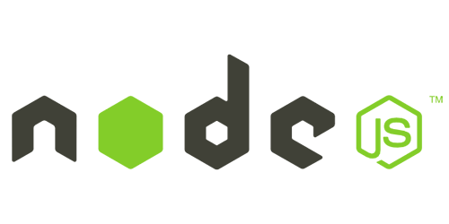

<h1 align="center" >Hi 👋🏽 I'am Armando B. Garcia</h1>

I'am an apassionate about technology and I love learning all what I can. Recently I obtained the **FullStack Developer** profile in **Henry BootCamp**.

I'am trained to create **Web or Movile Applications** with the next technologies.

